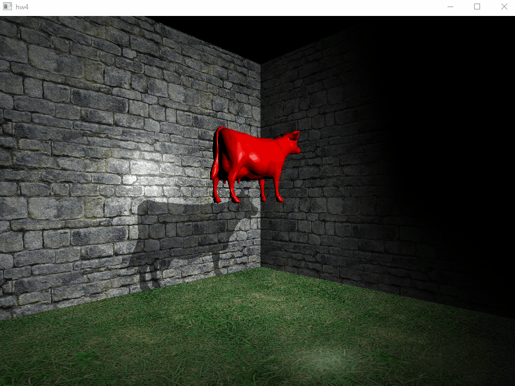

# CS543_HW4

Demo Video: https://www.youtube.com/watch?v=mt6X_ELP3Es

In this project I will add more realism to a high resolution model of a cow statue, implement per-fragment lighting, shading, texturing and shadows.

Summary of program behavior
Control your scene using the following keystrokes.
Key A: Toggle shadows ON/OFF. When ON, the shadows show up and when OFF the shadows do not show up. 

Key B Toggle ON/OFF between a scene with grass texture on floor and stone texture on the walls and a plain wall (no texturing). When ON, the floor is textured with grass and the walls are textured with stone. when OFF the floor and walls have no texturing, displaying a gray floor and blue walls. 

Key C: Toggle reflection ON/OFF. When ON, the buddha PLY is drawn with reflection. When OFF, the buddha PLY objects is drawn with no reflection (rendered as a solid model with per-fragment lighting). Select an appropriate shininess (reflectivity) for the buddha model.

Key D: Toggle refraction ON/OFF. When ON, the buddha PLY is drawn with refraction. When OFF, the buddha PLY file is drawn with no refraction ( rendered as a solid model with per-fragment lighting). Select an appropriate refractive index for the buddha model. 

(Key 'P'): Increase spotlight cut off angle (increase cone angle) by a small amount

(Key 'p'): Decrease spotlight cut off angle (decrease cone angle) by a small amount

(Key 'S'): Increase the shininess of the Buddha (specular exponent) by a small amount 

(Key 's'): Decrease the shininess of the Buddha (specular exponent) by a small amount 

(Key 'I'): Increase the index of refraction of the Buddha by a small amount 

(Key 'i'): Decrease the index of refraction of the Buddha by a small amount 

(Key 'F'): Increase the fog by a small amount 

(Key 'f'): Decrease the fog by a small amount
